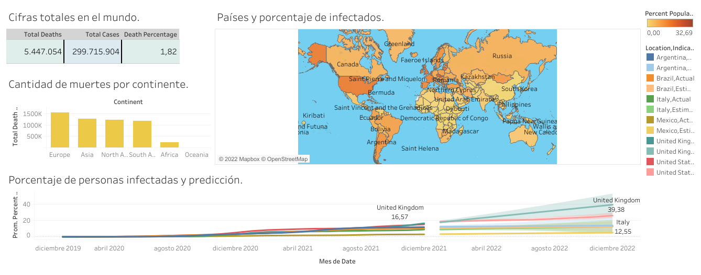

# portfolioprojects
Data analysis course made by Alex the analyst on youtube

# Español
Curso de análisis de datos hecho por alex en su canal de youtube. 
Cuenta con consultas personalizadas hechas por mí.
Profundiza sobre sql, exploración de datos y visualización de datos.

# English
Data analysis course made by alex on his youtube channel. 
It has custom queries made by me.
It goes in depth about sql, data exploration and data visualization.

# Technologies
* SQL
* Tableau
* Microsoft Excel

# Images
Covid dashboard

# Link to public tableau dashboards.

[Covid dashboard](https://public.tableau.com/app/profile/federico.bravin/viz/Firstcoviddashboard/Dashboard1?publish=yes)
