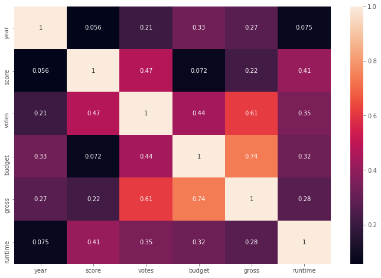
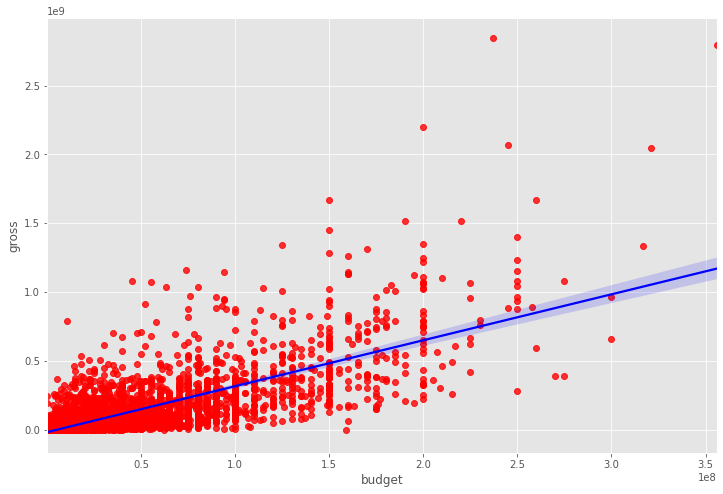

# Español
Análisis de la información de las películas de Hollywood de los últimos 40 años.
Buscando la correlación entre presupuesto y ganancias.

# English
Analysis of Hollywood movie data from the last 40 years.
Looking for the correlation between budget and earnings.

# Technologies 
* Python
* Jupyrt notebook
* Pandas
* Numpy
* Seaboran
* Matplotlib

# Images

Correlación tipo matriz / Matriz correlation

Correlación tipo puntos / Scatter Plot correlation

